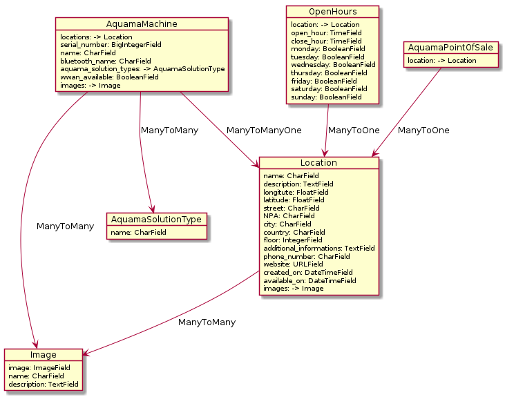

# Models #

This document talk about the models of this app.

List of models:
- `Location`
- `OpeningHours`
- `AquamaMachine`
- `AquamaPointOfSale`
- `Image`

## `Location` ##

A Location is a point on a map, defined by an address or by
longitude/latitude.

Properties:
- `name` (CharField, unique, required): The name of a location
- `description` (TextField, optional): The description of a location
- `longitude` (FloatField, optional): The longitude of a geolocation
- `latitude` (FloatField, optional): The latitude of a geolocation
- `street` (CharField, optional): The street name and number of a geolocation
- `NPA` (CharField, optional): The Postcode of a geolocation
- `city` (CharField, optional): The city name of a geolocation
- `country` (CharField, optional): The country name of a geolocation
- `floor` (IntegerField, optional): The floor of a geolocation
- `additional_informations` (TextField, optional): More details about
  the location or how to access it
- `phone_number` (CharField, optional): The phone number of a location
- `website` (URLField, optional): The website URL of a location
- `created_on` (DateTimeField, required, auto-filled if empty at
  model creation): The ceration date of a location
- `available_on` (DateTimeField, optional): Date when a location is
  available
- `images`: (ManyToMany, opitonal): The link to one or more images

## `OpeningHour` ##

When a location is open or close.

Properties:
- `location` (ManyToOne, required): The link to a parent location
- `opening_time` (TimeField, required): The opening time
- `closing_time` (TimeField, required): The closing time
- `monday` (BooleanField, optional): If this opening and close time
  apply on Monday
- `thuesday` (BooleanField, optional): If this opening and close time
  apply on thuesday
- `wednesday` (BooleanField, optional): If this opening and close time
  apply on wednesday
- `tursday` (BooleanField, optional): If this opening and close time
  apply on thursday
- `friday` (BooleanField, optional): If this opening and close time
  apply on friday
- `saturday` (BooleanField, optional): If this opening and close time
  apply on saturday
- `sunday` (BooleanField, optional): If this opening and close time
  apply on sunday

## `AquamaMachine` ##

An Aquama machine. Linked to a location.

To find the geolocation of a machine, get its location then the most
recent geolocation of this location.

Properties:
- `location` (ManyToOne, required): The link to a parent location
- `serial_number` (BigIntegerField, required, primary key): Serial
  number of the machine
- `name` (CharField, required): Name of the machine
- `bluetooth_name` (CharField, required): Name announced by the
  machine on Bluetooth
- `aquama_solution_type` (ManyToMany, optional): The link to one or
  more types of Aquama solution (`AquamaSolutionType`)
- `wwan_available`: (BooleanField, default: false) Is WWAN available
- `images`: (ManyToMany, optional): The link to one or more images

Relation to `Location`: This relation is done trough an third entity with
a field nammed `when` to specify when the machin was on a location.

## `AquamaSolutionType`

A type of Aquama solution an Aquama machine can do.

Properties:
- `name`(CharField, required): Name of the Aquama solution

## `AquamaPointOfSale` ##

A point of sale for Aquama products.

Properties:
- `location` (ManyToOne, required): The link to a parent location
TBD

## `Image` ##

An image.

Properties:
- `image` (ImageField, required): The image
- `name` (CharField, required): Image name
- `description` (TextField, optional): The description of a location

## Schema of models ##

